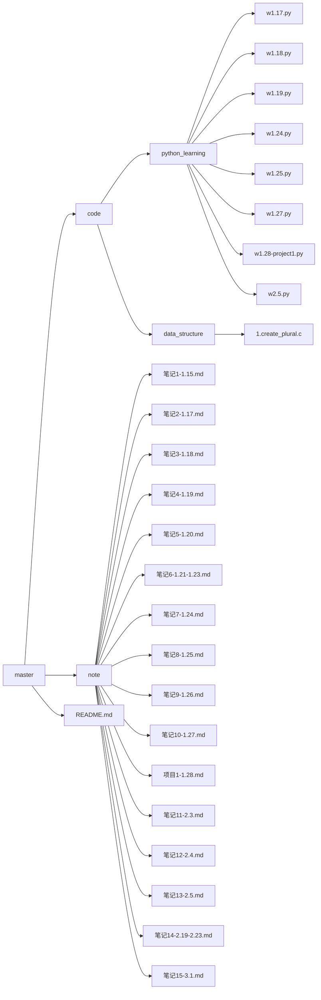

##### 1.15

==note --> 笔记1[1.15].md==

* anaconda,pycharm,jupyter使用
* 简单的markdown语法
* 编辑器typora安装
* markdown语法学习
* 图床配置

##### 1.16

* 拥有自己的github仓库
* GitHub desktop的使用

##### 1.17

==note --> 笔记2[1.17]==

==code --> python_learning --> w1.17.py==

* 基础语法与缩进
* 数字类型
  * int float bool complex
* 数据结构
  * 字符串 列表 字典 元组 集合 切片

##### 1.18

==note --> 笔记3[1.18]==

==code --> python_learning --> w1.18.py==

* 条件控制以及循环控制
* 推导式
* 错误和异常捕获
* map，lambda，fitter函数的使用

##### 1.19

==note --> 笔记4[1.19]==

==code --> python_learning --> w1.19.py==

* 面向对象
  * 类与实例化 类变量以及方法 私有变量和私有方法 封装 继承 多态

##### 1.20

==note --> 笔记5[1.20]==

- 总结1.17~1.19学习python的内容

##### 1.21-1.23

==note --> 笔记6[1.21-1.23]==

* 线性方程基础概念
  * 向量
  * 矩阵乘法
  * 行列式
  * 矩阵转置以及对应的性质
  * 矩阵的逆以及对应的性质

##### 1.24

==note --> 笔记7[1.24]==

==code --> python_learning --> w1.24.py==

- jupyter notebook的配置与使用
- numpy库学习
  - 基于列表构建矩阵
  - 特殊矩阵构建
  - 矩阵乘法
  - 矩阵广播机制
  - 矩阵转置
  - 矩阵的逆
  - 矩阵存取

##### 1.25

==note --> 笔记8[1.25]==

==code --> python_learning --> w1.25.py==

* pandas库学习
  * Series&DataFrame
  * 初步学习读取数据
  * 简单的数据清洗

##### 1.26

==note --> 笔记9[1.26]==

- 总结1.17~1.19学习python的内容

##### 1.27

==note --> 笔记10[1.27]==

==code --> python_learning --> w1.27.py==

* matplotlib库学习
  * 基础的绘图语法
    * 散点图
    * 曲线图
    * 条形图
    * 扇形图

##### 1.28

==note --> 项目1[1.28]==

==code --> python_learning --> w1.28-project1.py==

- 泰坦尼克号数据集可视化
  - 分别设计对各指标的生还数（率）进行对比可视化
  - 分析可视化结果

##### 2.3

==note --> 笔记11[2.3]==

* 机器学习概念入门
  * 有监督学习&无监督学习
  * 训练集，验证集，测试集
  * 过拟合，欠拟合
  * 损失函数
  * 模型评价指标
  * 常见数据清洗，特征工程

##### 2.4

==note --> 笔记12[2.4]==

- 多元线性回归梯度下降法求解
  - 梯度下降法
- 多元线性回归解析解
  - 最小二乘法构建损失函数 求矩阵与向量偏导并手推公式

##### 2.5

==note --> 笔记13[2.5]==

==code --> python_learning --> w2.5.py==

- 完成多元线性回归的类封装
  - 代码实现解析解求解和梯度下降法求解，**参考sklearn接口形式** ，不允许调用机器学习库，仅可使用numpy以波士顿房价数据集为例，划分训练集，测试集，并完成数据分析和预处理，完成模型训练并予以评价分析结果

##### 2.19-2.23

==note --> 笔记14[2.19-2.23]==

- 数据结构
  - 链表
  - 栈
  - 队列
  - 树
  - 图
  - 尝试用c语言实现

##### 3.1

==note --> 笔记15[3.1]==

- 文献阅读方法