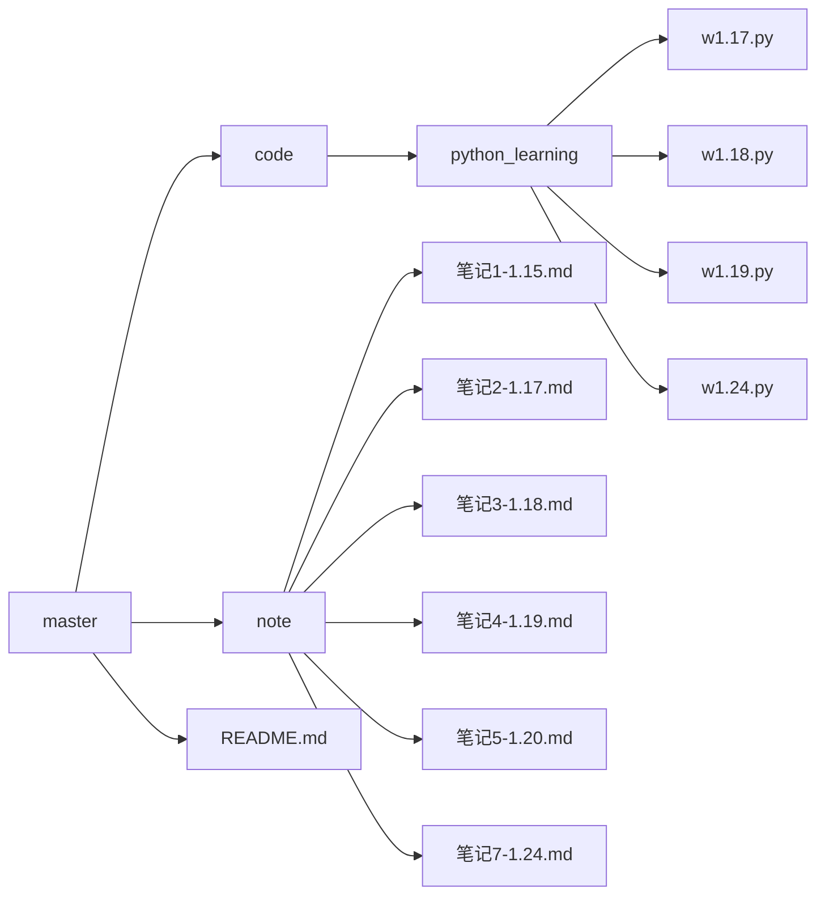

##### 1.15

==note --> 笔记1[1.15].md==

* anaconda,pycharm,jupyter使用
* 简单的markdown语法
* 编辑器typora安装
* markdown语法学习
* 图床配置

##### 1.16

* 拥有自己的github仓库
* GitHub desktop的使用

##### 1.17

==note --> 笔记2[1.17]==

==code --> python_learning --> w1.17.py==

* 基础语法与缩进
* 数字类型
  * int float bool complex
* 数据结构
  * 字符串 列表 字典 元组 集合 切片

##### 1.18

==note --> 笔记3[1.18]==

==code --> python_learning --> w1.18.py==

* 条件控制以及循环控制
* 推导式
* 错误和异常捕获
* map，lambda，fitter函数的使用

##### 1.19

==note --> 笔记4[1.19]==

==code --> python_learning --> w1.19.py==

* 面向对象
  * 类与实例化 类变量以及方法 私有变量和私有方法 封装 继承 多态

##### 1.20

==note --> 笔记5[1.20]==

- 总结1.17~1.19学习python的内容

##### 1.21-1.23

==note --> 笔记6[1.21-1.23]==

* 线性方程基础概念
  * 向量
  * 矩阵乘法
  * 行列式
  * 矩阵转置以及对应的性质
  * 矩阵的逆以及对应的性质

##### 1.24

==note --> 笔记7[1.24]==

==code --> python_learning --> w1.24.py==

- jupyter notebook的配置与使用
- numpy库学习
  - 基于列表构建矩阵
  - 特殊矩阵构建
  - 矩阵乘法
  - 矩阵广播机制
  - 矩阵转置
  - 矩阵的逆
  - 矩阵存取